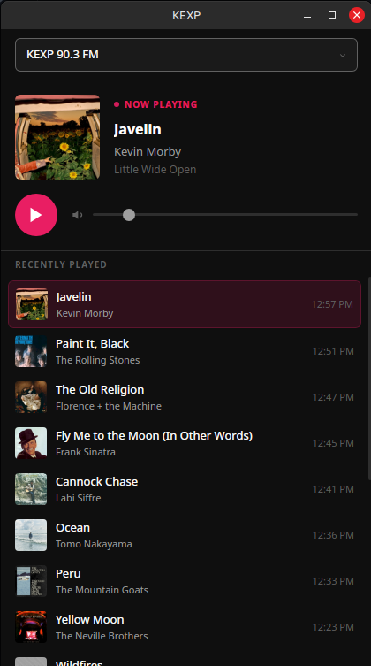

# 📻 KEXP & WFMU Player

A sleek vibe-coded Linux desktop app for streaming: 
- [KEXP 90.3 FM](https://www.kexp.org/) — Seattle's legendary independent radio station
- [WFMU 91.1 FM](https://wfmu.org/) — Listener-supported, independent community radio station in Jersey City, New Jersey


## ⚠️ Disclaimer

This project and its maintainer are not affiliated nor associated with KEXP or WFMU


## ✨ Features

- 🎵 **Live streaming** — One-click play/pause for KEXP's 128kbps MP3 stream - WFMU also now streams
- 🖼️ **Now Playing** — KEXP - Album art, artist, song title, and album displayed prominently. WFMU - Now Playing and static list of recently played songs
- 📜 **Scrollable feed** — Recently played tracks updated every 30 seconds
- 🔍 **Quick search** — Click any track to search DuckDuckGo for that song
- 🌑 **Dark theme** — Easy on the eyes, CSS variable-driven so you can tweak it!
- 🪶 **Lightweight** — Tauri means a ~13MB binary, not a 150MB Electron blob

---

## 🖥️ Screenshot



---

## 🚀 Getting Started

### Prerequisites

- [Node.js](https://nodejs.org/) 18+
- [Rust](https://rustup.rs/) 1.70+
- Linux with GTK3 + WebKit2GTK:

```bash
sudo apt install libwebkit2gtk-4.1-dev libgtk-3-dev librsvg2-dev
```

### Install & Run

```bash
git clone https://github.com/DiBop/kexp-player.git
cd kexp-player
npm install
npm run tauri dev
```

### Build a Release Binary

```bash
npm run tauri build
```

Output: `src-tauri/target/release/kexp-player`
Bundles: `.deb`, `.rpm`, `.AppImage` in `src-tauri/target/release/bundle/`

---

## 🎨 Customization

All colors live in `src/app.css` as CSS variables. Want a different accent color? Change one line:

```css
:root {
  --accent: #e91e63;        /* ← change this to anything */
  --accent-hover: #f06292;  /* ← and this for the hover shade */
  --bg-primary: #0f0f0f;    /* ← or go full midnight black */
}
```

---

## 🧪 Tests

```bash
npm test
```

---

## 🗺️ Architecture

```mermaid
graph TD
    User["👤 User"]

    subgraph Desktop["Linux Desktop"]
        subgraph Tauri["Tauri App — kexp-player"]
            subgraph Frontend["Svelte Frontend"]
                SS["StationSelector\ndropdown"]
                NP["NowPlaying\nart · song · artist · album"]
                PC["PlayerControls\nplay/pause · volume"]
                TF["TrackFeed\nrecently played · click to search"]
            end

            subgraph Backend["Rust Backend"]
                CMD["fetch_wfmu_html\nTauri command"]
                SHL["plugin-shell\nopen URLs"]
            end

            subgraph State["App State (page.svelte)"]
                SEL["selectedStation"]
                PLAYS["plays array"]
                POLL["30s poll interval"]
            end

            LS["💾 localStorage\nwfmu-history (up to 10 tracks)"]
        end
    end

    subgraph Internet["Internet"]
        subgraph KEXP["KEXP 90.3 FM"]
            KS["Stream\nkexp-mp3-128.streamguys1.com"]
            KA["REST API\napi.kexp.org/v2/plays\nreturns JSON · CORS enabled"]
        end

        subgraph WFMU["WFMU 91.1 FM"]
            WS["Stream\nstream0.wfmu.org/freeform-128k"]
            WA["Now Playing Page\nwfmu.org/currentliveshows_aggregator\nreturns HTML · no CORS"]
        end

        DDG["🔍 DuckDuckGo"]
    end

    User -->|selects station| SS
    User -->|play · pause · volume| PC
    User -->|clicks track| TF

    SS -->|updates| SEL
    SEL -->|triggers| POLL
    POLL -->|calls fetchPlays every 30s| State

    State -->|KEXP: fetch JSON directly| KA
    State -->|WFMU: invoke Rust command| CMD
    CMD -->|reqwest HTTP GET\nbypasses CORS| WA
    WA -->|raw HTML| CMD
    CMD -->|HTML string| Frontend
    Frontend -->|regex parse\nsong · artist| PLAYS

    KA -->|song · artist · album · art| PLAYS
    PLAYS -->|plays[0]| NP
    PLAYS -->|full list| TF

    PC -->|audio src| KS
    PC -->|audio src| WS

    TF -->|new WFMU track| LS
    LS -->|load on startup| PLAYS

    TF -->|artist + song query| SHL
    SHL -->|opens browser| DDG
```

---

## 🛠️ Tech Stack

| Layer | Tech |
|-------|------|
| App shell | [Tauri 2](https://tauri.app/) (Rust) |
| Frontend | [SvelteKit](https://kit.svelte.dev/) + TypeScript |
| Build | [Vite](https://vitejs.dev/) |
| Tests | [Vitest](https://vitest.dev/) |
| Audio | HTML5 `<audio>` |
| Now Playing | [KEXP Public API](https://api.kexp.org/v2/plays/) |

---

## 📡 KEXP

[KEXP 90.3 FM](https://www.kexp.org/) is a nonprofit community radio station based in Seattle, WA. They've been championing independent music since 1972. If you love this app, consider [supporting them](https://www.kexp.org/donate/).

---

## 📄 License

MIT — do whatever you want with it.
